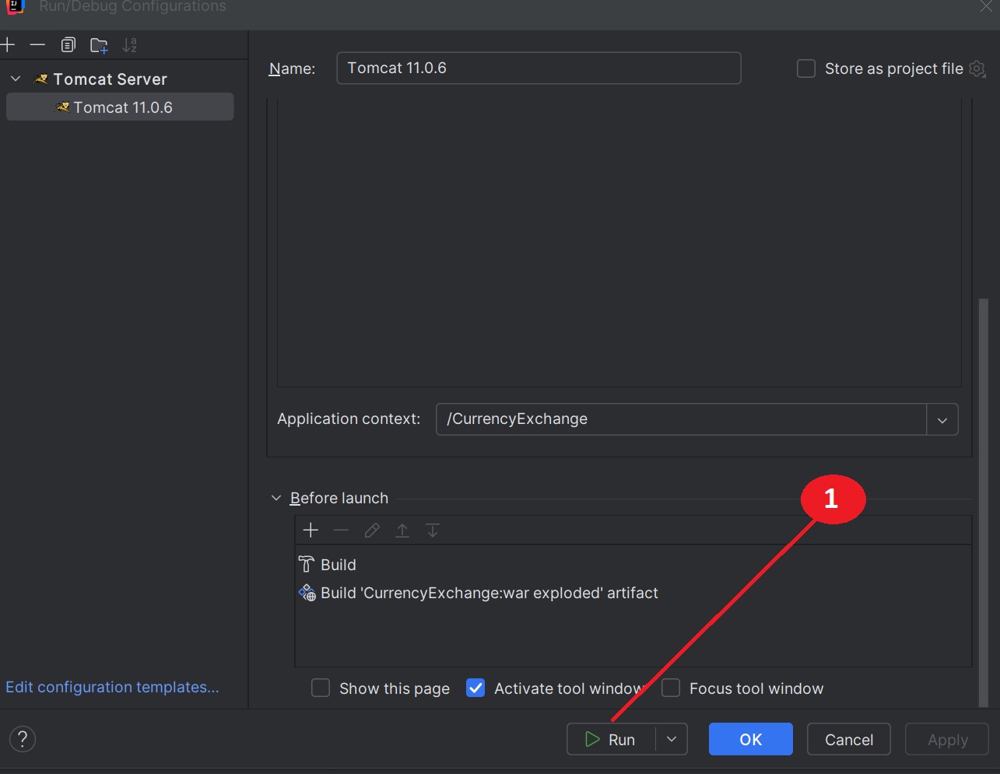

# Обмен валют
REST API для описания валют и обменных курсов. Позволяет просматривать и редактировать списки валют и обменных курсов, и совершать расчёт конвертации произвольных сумм из одной валюты в другую.

Это третий проект из Java Роадмап Сергея Жукова https://zhukovsd.github.io/java-backend-learning-course/

---
## Возможности приложения
- Добавление валюты или обменного курса для пары валют;
- Изменение существующего обменного курса;
- Конвертация валюты из одной в другую, при наличии прямого, обратного или кросс курса:
  - при наличии прямого обменного курса - используется он;
  - если нет прямого курса, но есть обратный - используется он;
  - если нет прямого или обратного курса, но есть два обменных курса "Доллар -> валюта1" и "Доллар -> валюта2" - используется он.
    

---
## Пример пользовательского интерфейса


---
## Используемые технологии
- Java 17
- Jakarta Servlet (Jakarta EE)
- JDBC
- SQLite
- Apache Maven 3.4.0
- Apache Tomcat 11.0.6
---
## Структура БД


## Описание REST API
**GET** ```/currencies```

Получение списка валют. Пример ответа:

```
[
    {
        "id": 0,
        "name": "United States dollar",
        "code": "USD",
        "sign": "$"
    },   
    {
        "id": 0,
        "name": "Euro",
        "code": "EUR",
        "sign": "€"
    }
]
```
HTTP коды ответов:
- Успех - 200
- Ошибка (например, база данных недоступна) - 500

**GET** ```/currency/EUR```

Получение конкретной валюты. Пример ответа:
```
{
    "id": 0,
    "name": "Euro",
    "code": "EUR",
    "sign": "€"
}
```
HTTP коды ответов:
- Успех - 200
- Код валюты отсутствует в адресе - 400
- Валюта не найдена - 404
- Ошибка (например, база данных недоступна) - 500

**POST** ```/currencies```

Добавление новой валюты в базу. Данные передаются в теле запроса в виде полей формы ```(x-www-form-urlencoded)```. Поля формы - ```name, code, sign```. Пример ответа - JSON представление вставленной в базу записи, включая её ID:
```
{
    "id": 0,
    "name": "Euro",
    "code": "EUR",
    "sign": "€"
}
```
HTTP коды ответов:
- Успех - 201
- Отсутствует нужное поле формы - 400
- Валюта с таким кодом уже существует - 409
- Ошибка (например, база данных недоступна) - 500

**Обменные курсы**

**GET** ```/exchangeRates```

Получение списка всех обменных курсов. Пример ответа:
```
[
    {
        "id": 0,
        "baseCurrency": {
            "id": 0,
            "name": "United States dollar",
            "code": "USD",
            "sign": "$"
        },
        "targetCurrency": {
            "id": 1,
            "name": "Euro",
            "code": "EUR",
            "sign": "€"
        },
        "rate": 0.99
    }
]
```
HTTP коды ответов:
- Успех - 200
- Ошибка (например, база данных недоступна) - 500

**GET** ```/exchangeRate/USDRUB```

Получение конкретного обменного курса. Валютная пара задаётся идущими подряд кодами валют в адресе запроса. Пример ответа:
```
{
    "id": 0,
    "baseCurrency": {
        "id": 0,
        "name": "United States dollar",
        "code": "USD",
        "sign": "$"
    },
    "targetCurrency": {
        "id": 2,
        "name": "Russian Ruble",
        "code": "RUB",
        "sign": "₽"
    },
    "rate": 80
}
```
HTTP коды ответов:
- Успех - 200
- Коды валют пары отсутствуют в адресе - 400
- Обменный курс для пары не найден - 404
- Ошибка (например, база данных недоступна) - 500

**POST** ```/exchangeRates```

Добавление нового обменного курса в базу. Данные передаются в теле запроса в виде полей формы ```(x-www-form-urlencoded)```. Поля формы - ```baseCurrencyCode, targetCurrencyCode, rate```. Пример полей формы:
- ```baseCurrencyCode``` - USD
- ```targetCurrencyCode``` - EUR
- ```rate``` - 0.99
Пример ответа - JSON представление вставленной в базу записи, включая её ID:
```
{
    "id": 0,
    "baseCurrency": {
        "id": 0,
        "name": "United States dollar",
        "code": "USD",
        "sign": "$"
    },
    "targetCurrency": {
        "id": 1,
        "name": "Euro",
        "code": "EUR",
        "sign": "€"
    },
    "rate": 0.99
}
```
HTTP коды ответов:
- Успех - 201
- Отсутствует нужное поле формы - 400
- Валютная пара с таким кодом уже существует - 409
- Одна (или обе) валюта из валютной пары не существует в БД - 404
- Ошибка (например, база данных недоступна) - 500

**PATCH** ```/exchangeRate/USDRUB```

Обновление существующего в базе обменного курса. Валютная пара задаётся идущими подряд кодами валют в адресе запроса. Данные передаются в теле запроса в виде полей формы ```(x-www-form-urlencoded)```. Единственное поле формы - ```rate```.

Пример ответа - JSON представление обновлённой записи в базе данных, включая её ID:
```
{
    "id": 0,
    "baseCurrency": {
        "id": 0,
        "name": "United States dollar",
        "code": "USD",
        "sign": "$"
    },
    "targetCurrency": {
        "id": 2,
        "name": "Russian Ruble",
        "code": "RUB",
        "sign": "₽"
    },
    "rate": 80
}
```
HTTP коды ответов:

- Успех - 200
- Отсутствует нужное поле формы - 400
- Валютная пара отсутствует в базе данных - 404
- Ошибка (например, база данных недоступна) - 500

**Обмен валюты**

**GET** ```/exchange?from=BASE_CURRENCY_CODE&to=TARGET_CURRENCY_CODE&amount=$AMOUNT```

Расчёт перевода определённого количества средств из одной валюты в другую. Пример запроса - **GET** ```/exchange?from=USD&to=AUD&amount=10```.

Пример ответа:
```
{
    "baseCurrency": {
        "id": 0,
        "name": "United States dollar",
        "code": "USD",
        "sign": "$"
    },
    "targetCurrency": {
        "id": 1,
        "name": "Australian dollar",
        "code": "AUD",
        "sign": "A$"
    },
    "rate": 1.45,
    "amount": 10.00,
    "convertedAmount": 14.50
}
```
## Локальный запуск с использованием IntelliJ IDEA Ultimate
- Клонировать репозиторий https://github.com/PetrovYegor/CurrencyExchange.git
- Открыть проект через Intellij IDEA Ultimate: File -> Open -> выбрать директорию с проектом (при возникновении предупреждающего окна нажать "Trust Project");
- Выполнить скрипт для Maven нажатием на "Load";
  
- В IntelliJ IDEA нажать "Current File" -> Edit Configurations;
  
- В появившемся окне "Run/Debug configurations" нажать на "+", затем слева выбрать пункт "Tomcat Server", подпункт "Local";
  
- Во вкладке "Server" через кнопку "Configure" указать локальный путь до папки томката 10 или 11 версии (при его отсутствии скачать с официального сайта);
  
- В правом нижнем углу нажать "Fix", в окне "Select an artifact to deploy" выбрать пункт "CurrencyExchange:war exploded";
  
- Во вкладке "Deployment" в поле "Application context" заменить путь с "/CurrencyExchange_war_exploded" на "/CurrencyExchange";
  
  
- Нажать "Run". Apache Maven выполнит сборку проекта и запустит его с помощью Tomcat. В браузере откроется вкладка с адресом "http://localhost:8080/CurrencyExchange/", где можно будет воспользоваться приложением через готовый UI.
  
  